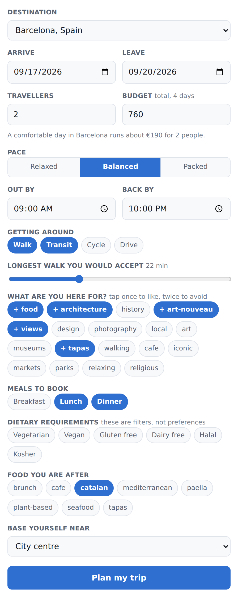
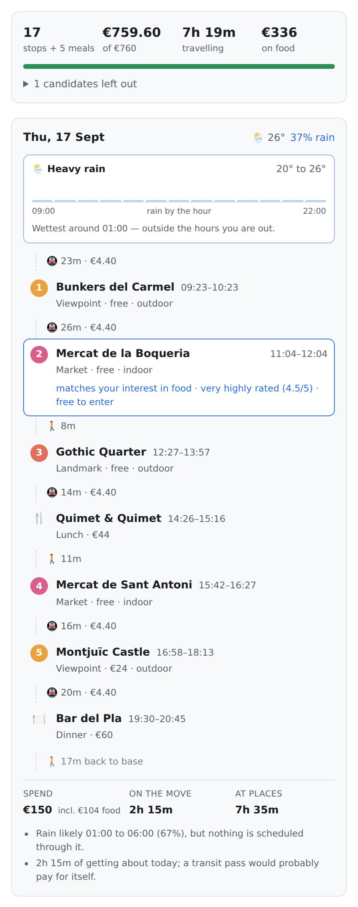

# AI Travel Planner

An interactive map that plans a trip, rather than a chat window that writes one.

Most "AI itinerary" tools produce a plausible-looking list. This one produces a
*schedule*: an agent works out which places are open when, how long it takes to
get between them, what the whole thing costs, and what the weather is going to
do — then arranges the days around those facts and tells you why it made each
call.

<table>
<tr>
<td width="50%" valign="top">

**You say what you like and what you can spend.**



</td>
<td width="50%" valign="top">

**It hands back a day that works.**

<picture>
  <source media="(prefers-color-scheme: dark)" srcset="docs/ui-itinerary-dark.png">
  
</picture>

</td>
</tr>
</table>

## What a planned day actually looks like

Every bar below comes from a real `planTrip` call — the diagrams in this README
are generated by `npm run diagrams`, not drawn, so they cannot quietly stop
matching the engine.


Two things are worth staring at. **Santa Maria del Mar** has two pale bands, not
one: it shuts between 13:00 and 17:00, and the visit lands in the second window.
**Bar del Pla** has no band at all before 12:30 — it is a kitchen, not a museum —
and dinner sits at the end of the day, where dinner belongs.

The same day, on the ground:


Two geographic clusters, one in the morning and one in the afternoon, rather than
a day spent criss-crossing the city. That falls out of the insertion strategy
rather than being imposed: a stop only gets in if its appeal justifies the detour
it adds.

*(The live app draws this on an OpenStreetMap basemap; the figure above is
plotted straight from the itinerary so it stays legible in a README.)*

## The forecast rearranges the day

This is the part that makes it an agent rather than a template. Weather is scored
per *slot*, not per day — so the question is never "is it a rainy day" but "what
should you be doing at 14:00":


Nothing about the day is fixed except the facts it has to work around.

## What the planner reasons about

| Concern | How it is handled |
| --- | --- |
| **Opening hours** | Per-weekday windows, split hours (the lunchtime closure), and date-specific exceptions for public holidays. A visit is never allowed to straddle a closure. |
| **Travel time** | Door-to-door estimates per mode, including the fixed overhead of using it, so a two-stop transit hop correctly loses to a walk. The journey home is costed too. |
| **Budget** | A hard ceiling, not a suggestion: tickets are charged per traveller, fares per party or per person as appropriate, and the trip total is checked on every insertion. |
| **User preferences** | Interest tags weighted from −1 to +1, pace, the hours you actually want to be out, how far you will walk, which modes you will use, must-sees and categories to skip. |
| **Weather** | Scored per slot: the gallery goes in the wet hours and the park in the dry ones, outdoor stops move to the drier of two days, and heat, cold, wind on exposed sites and a beach too cold to be worth the trip all count. |
| **Restaurants** | Booked into breakfast, lunch and dinner windows *after* the route exists, so a restaurant is chosen relative to where you already are. Dietary needs are a hard filter; cuisine, price and rating are scored. |

### The budget is a ceiling


Food money is reserved before sightseeing starts. Without a reserve, sightseeing
spends it first and the traveller ends up with a beautiful itinerary and nothing
to eat — but the reserve only applies when meals are actually being planned,
because holding back a third of the budget for meals nobody asked for would just
shrink the trip.

## How it is built


Pass 2 is slower than filling days front-to-back, but it is what produces days
that hang together geographically. Pass 3 runs *after* pass 2 on purpose:
booking lunch first, with nothing else on the map, just picks the best-reviewed
place in the city and drags the day across town to reach it.

Two decisions do most of the work:

- **Time is `MinuteOfDay`, never `Date`.** All clock arithmetic happens in
  minutes since local midnight, so the scheduler has no timezone or DST bugs to
  have.
- **Days are re-timed from scratch, never patched.** Every insertion recomputes
  the whole day from its anchor, so a change to the morning correctly ripples
  into every later arrival time.

Scoring puts interest ahead of reputation on purpose. A four-star museum the
traveller has no appetite for should lose to a three-star one they actually want
to see; a planner that optimises for ratings just rebuilds the same generic
top-ten list for everybody. The price scale is anchored to the traveller's own
budget rather than hard-coded, which is how the same code judges a €26 ticket
and a ¥1300 one without knowing anything about exchange rates.

When a day is too full to take a meal, the planner will drop its least valuable
stop to make room — but only when the meal is worth most of what it displaces,
and it says which stop it dropped and why. Eating is not optional in the way a
fifth museum is.

## Getting started

```bash
npm install
npm run dev
```

That serves the API on `http://localhost:8787` and the map on
`http://localhost:5173`, with the browser proxied to the API so there is no CORS
in the way.

```bash
npm test          # the engine and API test suites
npm run typecheck
npm run build
npm run diagrams  # regenerate the figures in docs/ from real planner output
npm run demo --workspace @atp/server   # print a planned trip to the terminal
```

## Layout

```
packages/core     the domain model and the planning engine — pure TypeScript, no I/O
  types.ts        the domain: places, hours, weather, budget, itineraries
  time.ts         opening hours and minute-of-day arithmetic
  travel.ts       door-to-door estimates and the cached travel matrix
  scoring.ts      how much a traveller wants a place
  weather.ts      how well a place suits the conditions in its slot
  schedule.ts     re-timing, insertion search, and the shared plan state
  meals.ts        meal windows, restaurant scoring, and making room to eat
  planner.ts      the four passes, and the notes that explain them

packages/server   HTTP API, the destination dataset, and the forecast provider
apps/web          React + Leaflet map interface
```

`@atp/core` is deliberately free of I/O: it takes a `PlanRequest` and returns an
`Itinerary`, which is what makes the scheduling behaviour testable without a
network or a clock.

## API

```
GET  /api/health
GET  /api/destinations
GET  /api/destinations/:id
GET  /api/destinations/:id/forecast?startDate=&endDate=
POST /api/plan
```

```bash
curl -s localhost:8787/api/plan -H 'content-type: application/json' -d '{
  "destinationId": "barcelona",
  "startDate": "2026-05-11",
  "endDate": "2026-05-14",
  "budgetTotal": 900,
  "preferences": {
    "interests": { "architecture": 1, "art-nouveau": 0.9, "views": 0.7 },
    "pace": "balanced",
    "travelers": 2,
    "dayEnd": "22:00",
    "meals": ["lunch", "dinner"],
    "cuisines": ["catalan", "tapas"],
    "dietary": ["vegetarian"]
  }
}'
```

## What it does not do yet

Stated plainly, because a planner that overstates itself is worse than one that
does less:

- **It reorders around the weather, but never delays for it.** If a shower is
  forecast for the next hour, the planner will move an indoor stop into it — but
  it will not hold an outdoor stop back forty minutes to let the rain pass.
- **It plans; it does not yet re-plan.** There is no way to say "I'm running
  ninety minutes late" or "this closed unexpectedly" and have the rest of the day
  rearrange itself around what is already fixed.
- **The route is greedy, not optimised.** Insertion produces coherent days, but
  no local search pass runs afterwards to shave off the remaining detours.
- **The data is a seed set, not live.** See below.

## About the data

Barcelona, Kyoto and Lisbon ship as a curated seed dataset so the planner is
demonstrable offline and its behaviour is reproducible in tests. Coordinates,
prices, ratings and opening hours are **approximate** — good enough to exercise
the scheduler, not good enough to plan a real holiday on. Live providers
(OpenStreetMap for places, Open-Meteo for weather, OSRM for routing) are the
next piece of work; the provider interfaces they slot into already exist.

The forecast provider is likewise a deterministic, climate-shaped stand-in, not
a prediction. Latitude sets the annual mean and the size of the seasonal swing,
and a hash of the coordinate and date supplies the day-to-day variation — which
means the same trip always replans identically, and the weather logic can be
tested without a network.

## Licence

MIT
